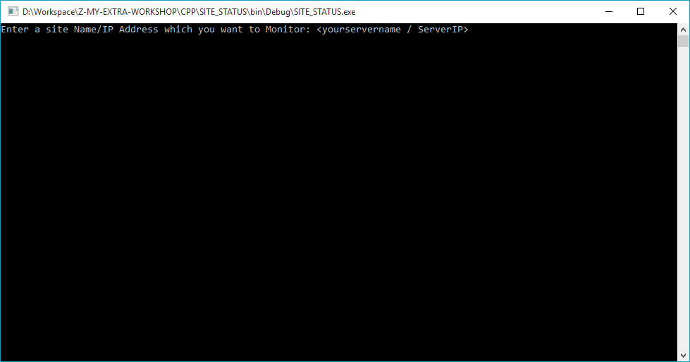
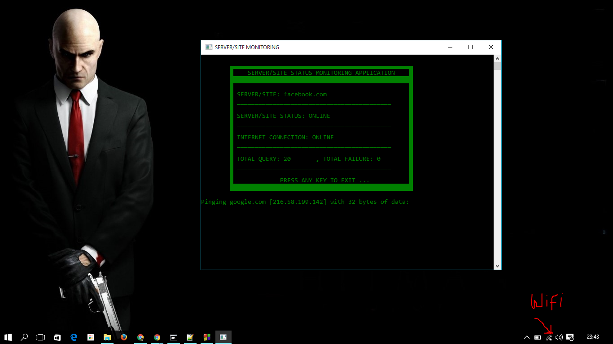
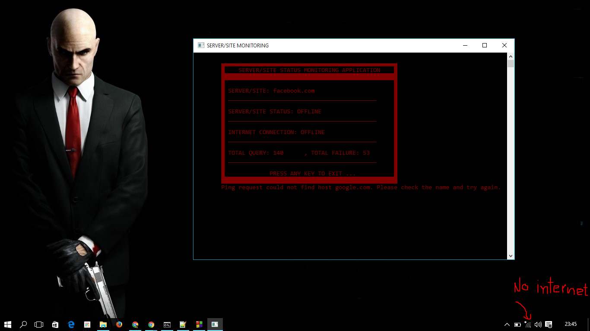

# Server-Status-Monitor
Its a Console application in C++, Monitor the specified Server/site status for UP and DOWN as well as current system internet connectivity.

#Extra features
1- Coloring according to server status / connectivity
 [Red if not connected, Green if connected]

2- Sound [diff. sound for both connected and not connected states]

3- Build on Codeblock 13.12 with GNU C++ Compiler.

#Screenshots

